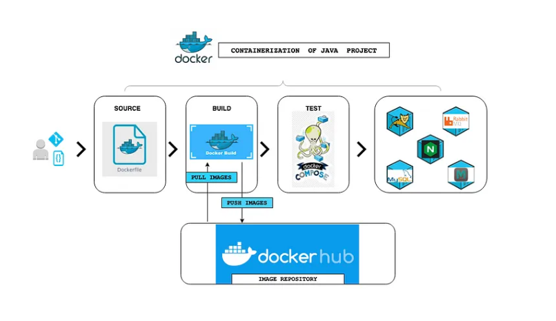

## CONTAINERIZING JAVA STACK APPLICATION WITH DOCKER 

I will be containerizing the [AWS-Lift-and-Shift-project](https://github.com/dybran/AWS-Lift-and-Shift-Project/blob/main/AWS-Lift-and-Shift-Project.md).

__SCENARIO:__

We already have a multi tier application stack running on EC2 instances in the cloud environment which has many services to be managed by the operations or DevOps team. We need to run continous changes and regular deployments on the application.

__PROBLEMS:__

- __High Operational Expenditure:__ In the previous set up in the cloud, We will spend more in procuring the resources as the resources are over provisioned. This will increase the regular operational cost. In the application we deployed in AWS, we provisioned 10GB of RAM on the EC2 instance. The application does not use that much RAM and the remaining RAM is not used and they accumulate bills.
- __Human Errors in Deployment:__ There is a chance of human error in deployment of the resources. Automation can reduce the chance of human error.
- __Microservice:__ The application setup is not compatible with microservice architecture.
- __Not Portable:__ The application setup is not portable and the environment are not in sync. There are chances that it will work on dev envoronment and not work in production environment.

__SOLUTION:__
- __Containers:__ We can solve the above problems using containers. Containers consume very low resources and suites very well for microservices design.  The image is packaged with all the dependencies and libraries so it is portable, reuseable and repeatable and can work across any environment.

__Tools to be used in containerizing this project:__

- Docker - container run time environment.
- Nginx
- Tomcat
- Memcache
- Rabbitmq

__STEPS:__
- We should already be aware of the steps to setup the stack from the [AWS-Lift-and-Shift-project](https://github.com/dybran/AWS-Lift-and-Shift-Project/blob/main/AWS-Lift-and-Shift-Project.md).
- Find the right base images from dockerhub for all the services that we will be using for this setup
- Write Dockerfiles to customize images (mysql, tomcat and nginx) and  build the images.
- Write a docker compose.yml file to run multiple containers.
- Test the image and push to dockerhub.

__ARCHITECTURAL DESIGN__

First, fetch the source code from github, then write Dockerfiles for the services that needs customization. The base images mentioned in the Dockerfile will be pulled from dockerhub. Then we will build the images. Once the images are ready, we will mention all the containers with the image name in the docker compose file and test it. If this works well we will then push the images to dockerhub.